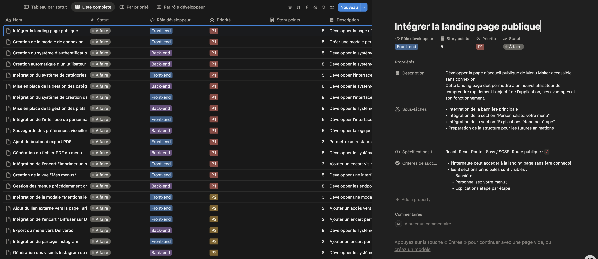

# 🍽️ Menu Maker by Qwenta

<p align="center">
  
</p>

<p align="center">


</p>

---

# 📖 À propos

**Menu Maker by Qwenta** est le sixième projet réalisé dans le cadre de la formation **Développeur Web OpenClassrooms**.

L'objectif était de préparer le développement d'une application destinée aux restaurateurs permettant de créer et personnaliser leurs menus.

Ce projet ne consistait pas à développer l'application, mais à analyser les besoins fonctionnels, rédiger les spécifications techniques, organiser le développement selon une méthodologie Agile et mettre en place une veille technologique.

---

# 🎯 Objectifs

- Analyser les besoins du client.
- Définir les fonctionnalités de l'application.
- Rédiger les spécifications techniques.
- Organiser le développement avec Scrum.
- Construire un tableau Kanban.
- Réaliser une veille technologique.

---

# ✨ Livrables réalisés

- 📄 Cahier des spécifications techniques
- 📋 Tableau Kanban
- 📚 Veille technologique
- 📽️ Support de présentation du projet

---

# 📂 Structure du projet

```text
Menu Maker/
│
├── assets/
│   ├── logo.png
│   ├── preview.png
│   ├── maquette1.png
│   ├── maquette2.png
│   ├── maquette3.png
│   ├── maquette4.png
│   ├── maquette5.png
│   └── maquette6.png
│
├── Zemouchi_Mohamed_1_specifications_techniques.pdf
├── Zemouchi_Mohamed_2_kanban_062026.pdf
├── Zemouchi_Mohamed_3_veille_062026.pdf
├── Zemouchi_Mohamed_4_presentation.pdf
│
├── portfolio.json
└── README.md
```

---

# 🎯 Compétences développées

Au cours de ce projet, j'ai appris à :

- Analyser les besoins d'un client.
- Rédiger un cahier des spécifications techniques.
- Concevoir une architecture fonctionnelle.
- Organiser un projet selon la méthodologie Agile Scrum.
- Construire un tableau Kanban.
- Prioriser les User Stories.
- Réaliser une veille technologique.
- Présenter un projet devant un jury.

---

# 🔗 Liens

## 📂 Repository

https://github.com/MohamedZem/Menu-Maker

---

# 👨‍💻 Auteur

**Mohamed Zemouchi**

- 🌐 Portfolio : https://portfolio-mohamed-zemouchi.onrender.com/
- 💼 LinkedIn : www.linkedin.com/in/mohamed-zemouchi
- 💻 GitHub : https://github.com/MohamedZem